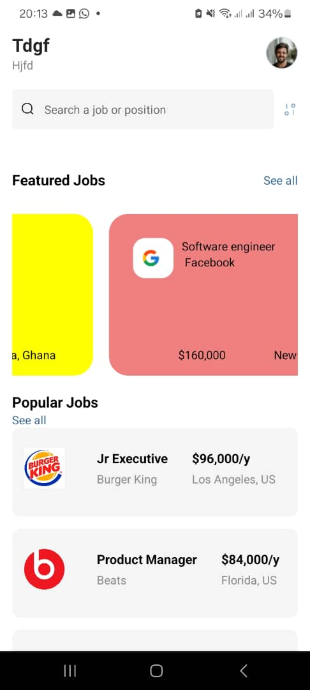
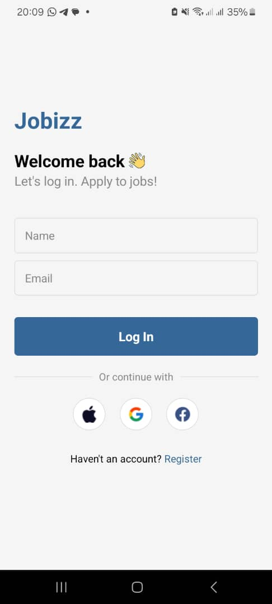

# rn-assignment4-11015722
# About the app
Jobizz is a mobile application designed to help users find and apply to various job opportunities. Below is a brief description of each component's usage within the app.

# Components
  # LoginScreen Component

Description:
 Allows users to log in with their name and email.

Usage: 
Users enter their credentials and can proceed to the home screen upon successful login.
 # HomeScreen Component
Description: Displays user information and job listings.
Usage: Shows featured jobs and popular job listings, allowing users to search for specific jobs.
 # Screenshots
 
 
